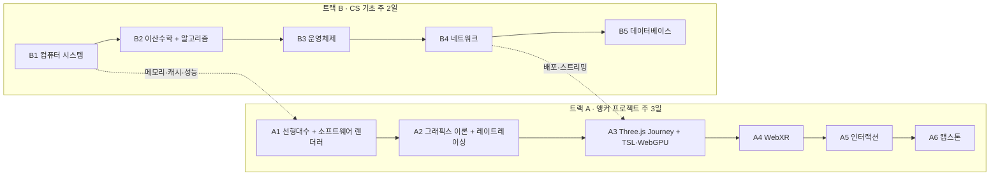

# 커리큘럼

## 요약

- **두 트랙을 동시에 진행한다.** 기초만 1년 하다 지쳐 포기하지 않기 위해서다.
  - **트랙 A · 앵커 프로젝트 (주 3일)**: 렌더러 하나를 만들어 계속 키운다. 수학과 그래픽스는 이 프로젝트에 필요한 순간에 배운다.
  - **트랙 B · CS 기초 (주 2일)**: 면접과 시스템 이해에 필요한 기초를 과목당 주 자료 하나로 순서대로 공부한다.
- 모든 과목은 영어 원문 강의와 교재를 주 자료로 삼는다. CS 공부와 영어 공부를 한 번에 하기 위해서다.
- 4주마다 체크포인트를 두고, `tools/stats.py` 결과와 체감을 보고 속도와 범위를 조정한다.
- 기간은 모두 **추정치**다. 밀리면 체크포인트에서 범위를 줄인다.

---

## 공부 규칙 (두 트랙 공통)

- **주 자료는 하나만 둔다.** "이게 맞나?" 싶을 때 다른 강의를 틀지 않는다. `/study`로 퀴즈를 풀어 확인한다. 대안 자료는 주 자료가 *막혀서 진도가 안 나갈 때만* 쓴다.
- **세션 흐름**: `/study <주제>`로 복습 퀴즈 → 확인 → 계획 → 학습 → 내 말로 3~5문장 → 노트와 커밋.
- **강의 듣기**: 영어 자막으로 시작하고, 익숙해지면 자막을 끈다. 한국어 자막은 쓰지 않는다. 목표는 3Blue1Brown 영상을 자막 없이 대부분 이해하는 수준이다.
- **영어 쓰기**: 따로 문서를 쓰지 않는다. teach-back 3~5문장을 영어로 써도 되는 정도로만 한다. 단어장도 만들지 않는다. 꼭 외울 일상 단어가 있으면 `log/quiz.tsv`에 `english` 주제로 넣어 복습 주기를 탄다.
- **노트**: Markdown + LaTeX(`$...$`). 다듬지 않는다.

※ 강의 개설 여부와 무료 여부는 바뀔 수 있으니 시작 전에 한 번 확인할 것.

---

## 트랙 A · 앵커 프로젝트 (주 3일)

결과물은 **저장소 하나**다. 단계마다 기능이 늘어나고, 그 커밋 기록이 그대로 포트폴리오가 된다.

### A1. 선형대수 + 소프트웨어 렌더러 (약 8주)

대상 과목: 선형대수학, 실감미디어융합(개론), C프로그래밍기초및실습(C/C++ 감각)

- 주 자료
  - 3Blue1Brown *Essence of Linear Algebra*: 개념을 그림으로 먼저 잡는다. 1~2주.
  - ssloy/tinyrenderer: OpenGL 없이 C++로 래스터라이저를 직접 만든다. 선분 → 삼각형 → z-buffer → 카메라 변환 → 셰이딩 순서.
  - MIT 18.06 (Gilbert Strang): **렌더러에서 막히는 개념의 강의만** 골라 본다. 전체를 끝까지 들을지는 A1 끝 체크포인트에서 정한다.
- 핵심 내용: 벡터, 내적·외적, 행렬 곱, 동차 좌표(homogeneous coordinates), 이동·회전·크기 변환, 투영, 무게중심 좌표(barycentric coordinates).
- 끝낼 때 남길 것: OBJ 모델을 조명과 함께 그리는 C++ 렌더러.

### A2. 그래픽스 이론 + 레이트레이싱 (약 8주)

대상 과목: 컴퓨터그래픽스, 기초통계학(확률 부분), 3D그래픽디자인

- 주 자료
  - UC Berkeley CS184/284A: 렌더링 파이프라인, 샘플링, 텍스처, 조명, 레이트레이싱. A1에서 직접 만든 것의 이론 정리.
  - *Ray Tracing in One Weekend* 시리즈: 렌더러에 레이트레이싱 모드를 추가한다. 3권째(*The Rest of Your Life*)에서 확률과 몬테카를로 적분이 필요할 때 그 부분만 배운다.
- 3D그래픽디자인: Blender 기초만 익혀 렌더러에 넣을 모델을 직접 만드는 정도로.
- 끝낼 때 남길 것: 같은 장면을 래스터화와 레이트레이싱으로 각각 그려 비교한 결과.

### A3. 웹 그래픽스: Three.js Journey + TSL·WebGPU (약 16~20주)

대상 과목: (웹 그래픽스, 학과 과목 없음)

A1·A2에서 직접 만든 것을 실무 라이브러리로 다시 만나는 단계다. 저수준을 먼저 해봤기 때문에 Three.js가 내부에서 무엇을 해주는지 보이고, 기초 챕터는 빠르게 넘길 수 있다.

- 주 자료: Three.js Journey (Bruno Simon), 구매한 코스를 아래 순서로
  1. 본 코스 1~3장 (Basics, Classic Techniques, Advanced Techniques): A1·A2와 겹치는 강의(카메라, 변환, 조명)는 배속으로 넘기고 실습만 한다.
  2. 본 코스 4장 Shaders (GLSL): TSL 코스의 선수 지식이라 건너뛰지 않는다.
  3. 본 코스 5장 Extra (후처리, 성능 최적화)
  4. **WebGPU & TSL 코스** (Fundamentals → Advanced Projects)
  - 6장 Portal Scene과 7장 React Three Fiber는 "선택적 확장"으로 미룬다.
- 참고 자료: webgpufundamentals.org. TSL이 실제로 어떤 WebGPU 호출과 WGSL로 바뀌는지 궁금할 때 본다.
- 읽을거리: Inigo Quilez의 글 모음 (셰이더 기법).
- 핵심 내용: 씬 그래프, 머티리얼과 라이트, GLSL 셰이더, TSL 노드 기반 셰이더, WebGPURenderer, 컴퓨트 셰이더를 쓴 파티클.
- 끝낼 때 남길 것: A1에서 C++로 직접 짠 조명 계산을 **TSL 셰이더로 다시 구현**하고, Three.js WebGPURenderer로 브라우저에 배포. 같은 장면을 C++ 렌더러 결과와 나란히 비교한다.
  - 선택: 셰이더 하나를 Three.js 없이 raw WebGPU + WGSL로 짜 보기. 그래픽스를 강점으로 내세울 때 차별점이 된다.

### A4. WebXR (약 6주)

대상 과목: 가상증강현실, XR프로그래밍, 공간컴퓨팅, 메타버스와가상세계(개념만)

- 주 자료: Stanford EE267 Virtual Reality (Gordon Wetzstein) 강의 자료. 머리 움직임 추적, 스테레오 렌더링, 렌즈 왜곡 보정.
- 구현 참고: MDN WebXR Device API 문서, Three.js WebXR 예제.
- 끝낼 때 남길 것: A3의 Three.js 장면을 WebXR로 확장해 브라우저에서 바로 실행되는 데모.

### A5. 인터랙션 / HCI (약 4주)

대상 과목: 휴먼미디어상호작용, 인터렉션프로그래밍, 휴먼인터페이스공학

- 주 자료: Stanford CS147 강의 자료.
- 핵심 내용: 입력 처리, 즉각적인 피드백 설계, 접근성, 사용성 테스트.
- 끝낼 때 남길 것: A4 데모의 조작 방식을 개선하고, 개선 전후 비교를 노트로 남기기.

### A6. 캡스톤

대상 과목: 실감미디어프로젝트, 미디어융합프로젝트(캡스톤디자인), XR융합프로젝트

A1~A5에서 키운 프로젝트를 완성작으로 다듬어 배포한다. 새 프로젝트를 시작하지 않는다.

---

## 트랙 B · CS 기초 (주 2일)

순서대로 진행한다. 결과물은 실험 기록과 노트이고, 따로 문서를 쓰지 않는다.

### B1. 컴퓨터 시스템 (약 8주)

대상 과목: 공학을위한컴퓨터과학적사고 (+ 학과에 없는 컴퓨터 구조)

- 주 자료: *Computer Systems: A Programmer's Perspective* (CS:APP). 데이터 표현, 기계어, 메모리 계층, 캐시, 링킹.
- 왜 먼저: 렌더러 성능(캐시 친화적인 메모리 배치)과 C++ 포인터를 이해하는 바탕이 된다. 면접에서도 자주 묻는다.
- 끝낼 때 남길 것: A1 렌더러의 데이터 배치를 바꿔 가며 캐시 효과를 측정한 기록.

### B2. 이산수학 + 알고리즘 (약 10주)

대상 과목: 자료구조와알고리즘 (+ 학과에 없는 이산수학)

- 주 자료
  - MIT 6.042J *Mathematics for Computer Science*: 증명, 귀납법, 그래프 이론, 수 세기(counting). 알고리즘에 필요한 장 위주로.
  - Stanford Algorithms Specialization (Tim Roughgarden): 분할 정복, 그래프 탐색, 해시, 탐욕 알고리즘, 동적 계획법.
- 실습: 트리, 그래프, 해시 테이블을 직접 구현한다. 언어는 C++(렌더러와 같은 언어) 또는 TypeScript 중 하나.
- 끝낼 때 남길 것: 구현 모음과, 각 알고리즘의 정확성을 내 말로 증명한 노트.

### B3. 운영체제 (약 6주)

- 주 자료: *Operating Systems: Three Easy Pieces* (OSTEP, 무료). 대안: UC Berkeley CS162 강의 영상.
- 핵심 내용: 프로세스와 스레드, CPU 스케줄링, 동기화와 락, 데드락 4조건과 예방, 가상 메모리.
- 끝낼 때 남길 것: 데드락이 생기는 코드와 해결한 코드를 나란히 둔 예제.

### B4. 네트워크 (약 6주)

- 주 자료: *Computer Networking: A Top-Down Approach* (Kurose & Ross). 대안: Stanford CS144 강의 영상.
- 핵심 내용: HTTP/HTTPS, TLS, DNS, TCP와 UDP(연결 수립, 순서 보장, 재전송, 흐름·혼잡 제어), HTTP 캐시, CORS, WebSocket.
- 끝낼 때 남길 것: 브라우저 개발자 도구로 잡은 요청 하나를 DNS 조회부터 응답까지 단계별로 설명한 노트.

### B5. 데이터베이스 (약 6주)

- 주 자료: CMU 15-445 *Intro to Database Systems* (Andy Pavlo). 대안: Stanford Databases (Jennifer Widom).
- 핵심 내용: SQL, 정규화, B+Tree 인덱스와 장단점, 트랜잭션과 격리 수준, 관계형 DB와 NoSQL 비교.
- 끝낼 때 남길 것: 인덱스를 걸기 전후의 조회·쓰기 속도를 직접 측정한 기록.

---

## 4주 체크포인트

4주마다 30분 동안 아래를 확인한다.

1. `python3 tools/stats.py`: 확신도별 정답률, 쌓여 있는 복습 대상
2. 두 트랙 진도가 추정치보다 얼마나 밀렸나 → 밀렸다면 범위를 줄인다(기간을 늘리지 않는다)
3. 트랙 A가 아직 재미있나? 트랙 B가 버틸 만한가? → 비율 조정 (3:2 ↔ 4:1)

---

## 선택적 확장 (필요할 때 진행)

| 과목 | 언제 필요해지나 |
| --- | --- |
| 인공지능 / 데이터과학 / 음성인식 | AI나 음성 입력을 결합하고 싶어질 때 (예: Stanford CS229, Andrew Ng의 Machine Learning Specialization) |
| 파이썬프로그래밍및실습 | AI 관련 실험, 데이터 처리가 필요할 때 |
| MIT 18.06 전체 완주 | A1 체크포인트에서 선형대수를 더 깊이 하기로 정했을 때 |
| Three.js Journey 7장 React Three Fiber | React 프로젝트에 3D를 넣거나, 프론트엔드 포지션에 지원할 때 |
| Three.js Journey 6장 Portal Scene | Blender로 장면을 만들고 베이킹하는 작업이 필요할 때 |
| 모바일응용소프트웨어 | 웹 결과물을 모바일 대응으로 확장할 때 |
| JAVA프로그래밍및실습 | 특정 엔진이나 백엔드 작업이 필요해질 때 |
| 오픈소스소프트웨어 / IoT시스템 | 특정 작업에서 직접 필요해질 때 |
| 기초통계학 (전체) | A5의 사용성 테스트 결과를 수치로 분석하고 싶어질 때 |
| 게임프로그래밍 / 게임소프트웨어 / 3D애니메이션 | 게임 개발에 다시 관심이 생기면 |
