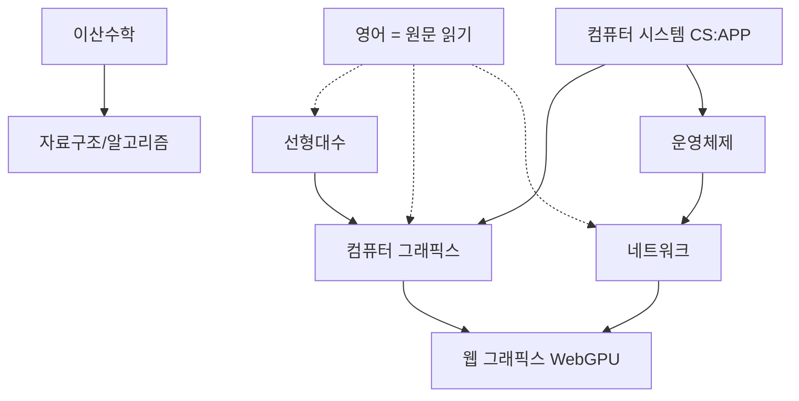

# learning

AI를 가이드로 삼아 "겉핥기"를 끝내기 위한 공부 저장소.
방법론은 아래, 실행은 `/study <주제>` (`.claude/skills/study`), 기록은 `notes/` 와 `log/quiz.tsv`.

## 참고한 사례

| 사례 | 가져온 것 |
| --- | --- |
| [DrCatHicks/learning-opportunities](https://github.com/DrCatHicks/learning-opportunities) | 학습과학 근거. 예측 먼저, 틀리면 **분명히 틀렸다고** 말하기, 세션 시작 시 회상 체크 |
| [amosblomqvist/learn](https://github.com/amosblomqvist/learn) | probe → plan → teach. 퀴즈로 지식의 경계를 위아래로 좁혀 찾기(binary search), 개념 의존성 DAG, "어떻게 내가 이걸 발견할 수 있었을까?" |
| [rlaope/estudy](https://github.com/rlaope/estudy) | 노트는 다듬지 않고 쌓는다(890개). 책 → LLM DFS → 온디맨드 프로젝트 순으로 "질문의 가치"가 올라간다 |

## 습관별 처방

### 1. 초심자 자료를 반복해서 찾는다 → 의심을 **숫자**로 바꾼다

문제는 내용이 어려운 게 아니라 "이게 맞나?"라는 의심이다. 초심자 영상은 아는 걸 다시 확인해주는 **안정제**일 뿐이고, 그렇게 쉽게 읽히는 느낌은 이해한 것으로 착각하게 만든다(유창성 착각).

- 모든 퀴즈에 **확신도(1~3)** 를 함께 기록한다. `python3 tools/stats.py` 로 "확신 1이었는데 정답률 80%" 같은 **캘리브레이션**을 본다. 의심이 근거 없다는 걸 데이터로 확인하는 장치다.
- 소크라테스식 질문은 유지하되 **틀리면 바로 틀렸다고** 말해준다. 교정 없이 질문만 계속하면 의심이 오히려 커진다. (기존 `socrates` 스킬은 "틀려도 교정하지 않기"라서 이 부분이 반대다.)
- 자료는 한 단계 위로 올린다. 블로그 대신 교재 챕터·RFC·스펙을 원문으로 읽고, AI는 검증자로 쓴다. 영어 공부는 이걸로 대신한다.

### 2. 정리에 시간을 쏟는다 → 정리는 AI가, **설명은 내가**

공개 정리가 좋다고들 하는 이유는 문장력 때문이 아니다. **내 말로 다시 생성하는 행위**(생성 효과, teach-back) 덕분이다. 다듬는 데 드는 시간은 학습에 거의 도움이 안 된다.

- 세션 끝에 내 말로 **3~5문장만** 설명한다. 문법이 틀려도 괜찮다.
- 노트 파일은 AI가 만든다: 내 설명은 원문 그대로, 여기에 DAG 다이어그램, 틀린 문제, 출처를 붙인다.
- 공개는 블로그가 아니라 `git commit` 으로 한다. 선배 노트도 오타가 그대로 있다. 중요한 건 숲이지 나무 한 그루의 수형이 아니다.

### 3. 동기 ("이게 도움이 될까?") → 공부를 **프로젝트의 부품**으로 만든다 (가설)

이건 도구로 해결되지 않는다. 그래서 가설로 두고 4주 뒤에 검증한다.

- **그래픽스를 앵커 프로젝트로** 삼는다. 소프트웨어 래스터라이저나 레이트레이서는 CRUD가 아니면서 선형대수·메모리·성능을 저절로 끌어온다.
- 모든 공부 세션의 DAG 종점(sink)은 "프로젝트의 어떤 부분에 쓰이는가"로 정한다. 예: 행렬 → 카메라 변환. 이러면 "도움이 될까"에 매번 구체적인 답이 생긴다(카파시식 온디맨드 학습).
- 기대치는 작게 잡는다. 하루 1세션, 30~60분. 대신 복리로 쌓는다(estudy `steady.md`).

### 4. 복습을 안 한다, 기초를 가볍게 여긴다 → 복습을 **세션 입장료**로 만든다

- `/study` 를 시작하면 먼저 `stats.py due` 에 나온 개념을 퀴즈로 회상한다. 복습을 따로 결심하지 않아도 된다.
- 간격은 맞힐 때마다 1 → 3 → 7 → 14 → 30 → 60일로 늘어나고, 틀리면 1일로 돌아간다.
- 기초를 "어디까지" 할지는 [teachyourselfcs.com](https://teachyourselfcs.com) 목록을 범위로 삼고, 깊이는 **그래픽스가 요구하는 만큼 + 면접에서 물을 만큼**으로 정한다.

## 과목 지도

| 과목 | 1차 자료 | 앵커 프로젝트 |
| --- | --- | --- |
| 선형대수 | 3Blue1Brown *Essence of Linear Algebra* → Strang MIT 18.06 | 래스터라이저 변환 파이프라인 |
| 컴퓨터 그래픽스 | ssloy/tinyrenderer, *Ray Tracing in One Weekend* | 직접 구현 |
| 웹 그래픽스 | webgpufundamentals.org | 위 렌더러를 WebGPU로 포팅 |
| 이산수학 | MIT 6.042J *Mathematics for Computer Science* | 알고리즘 문제 증명 |
| CS 기초 | CS:APP, OSTEP (teachyourselfcs 기준) | 렌더러 성능 측정/최적화 |
| 네트워크 | Kurose & Ross *Top-Down*, RFC 원문 | 웹 그래픽스 데모 배포/스트리밍 |

첫 4주 제안: **선형대수 + tinyrenderer** 병행. 4주 뒤 `stats.py` 결과와 체감으로 습관 3 가설을 평가한다.

## 하루 루틴

1. `/study` → 복습 퀴즈 (5분)
2. 오늘 주제: probe → plan(DAG 승인) → teach 루프 (30~50분)
3. 내 말로 3~5문장 → AI가 노트 생성 → commit
