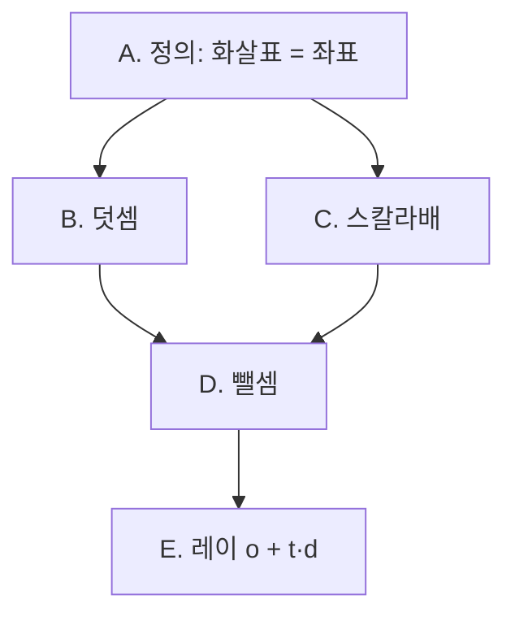
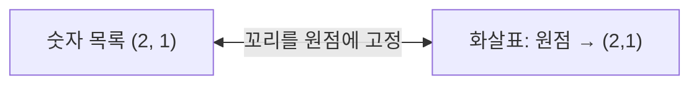
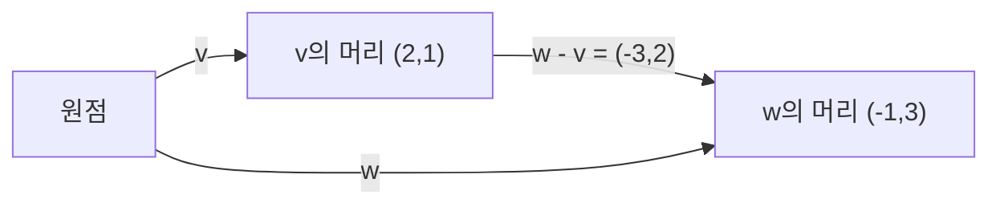

# 세션 기록 (2026-10-01)

> [!quote] YOU
> `/study`

> [!abstract] CLAUDE

계획표에서 오늘 항목을 고르고, 시작 시각과 복습 대상을 확인합니다.

> [!question] QUIZ
> **벡터 $\mathbf{v}=(2,1)$에 $\mathbf{w}=(-1,3)$을 더한 결과를 화살표로 그릴 때 맞는 설명은?**
> 1. v 끝점에 w 시작점 붙여 원점→w 끝
> 2. v 끝점과 w 끝점을 잇는 화살표
> 3. 모르겠음
>
> **확신도는?**
> 1. 1 찍음
> 2. 2 애매
> 3. 3 확실

> [!example] ANSWER
> 벡터 $\mathbf{v}=(2,1)$에 $\mathbf{w}=(-1,3)$을 더한 결과를 화살표로 그릴 때 맞는 설명은? → **v 끝점과 w 끝점을 잇는 화살표**
> 확신도는? → **2 애매**

> [!question] QUIZ
> **$\mathbf{v}=(2,1)$, $\mathbf{w}=(-1,3)$일 때 $\mathbf{v}+\mathbf{w}$의 좌표는?**
> 1. (-3, 2)
> 2. (1, 4)
> 3. 모르겠음
>
> **확신도는?**
> 1. 1 찍음
> 2. 2 애매
> 3. 3 확실

> [!example] ANSWER
> $\mathbf{v}=(2,1)$, $\mathbf{w}=(-1,3)$일 때 $\mathbf{v}+\mathbf{w}$의 좌표는? → **(1, 4)**
> 확신도는? → **2 애매**

> [!question] QUIZ
> **벡터 $\mathbf{v}=(2,1)$에 $-2$를 곱한 $-2\mathbf{v}$를 화살표로 그리면?**
> 1. 같은 직선, 반대 방향, 길이 2배
> 2. 직각으로 돌아간 방향, 길이 2배
> 3. 모르겠음
>
> **확신도는?**
> 1. 1 찍음
> 2. 2 애매
> 3. 3 확실

> [!example] ANSWER
> 벡터 $\mathbf{v}=(2,1)$에 $-2$를 곱한 $-2\mathbf{v}$를 화살표로 그리면? → **모르겠음**
> 확신도는? → **3 확실**

> [!question] QUIZ
> **이 DAG와 자료로 진행할까요?**
> 1. 승인
> 2. 수정 필요

> [!example] ANSWER
> 이 DAG와 자료로 진행할까요? → **계획을 보여줘야 승인을 하지**

> [!abstract] CLAUDE

사용자가 "계획을 보여줘야 승인하지"라고 했습니다. 승인 창이 앞의 글을 가려서 계획이 보이지 않았던 것 같습니다. 계획을 다시 적고, 이번에는 창을 띄우지 않고 답을 기다리겠습니다.

## 2. Plan: 벡터 (A-001)

**종점:** 레이 식 $\mathbf{p}(t) = \mathbf{o} + t\,\mathbf{d}$를 "점 $\mathbf{o}$에서 방향 $\mathbf{d}$로 $t$배만큼 이동"이라고 읽을 수 있는 것.

**노드 (위에서 아래 순서):**

| 노드 | 내용 | 왜 필요한가 |
|---|---|---|
| A. 정의 | 벡터 = 원점에서 시작하는 화살표 = 좌표 목록 $(x, y)$. EoLA의 세 관점 | 나머지 전부의 출발점 |
| B. 덧셈 | v의 머리에 w의 꼬리를 붙인다 ⇔ 성분끼리 더한다 | Q1에서 틀린 부분 |
| C. 스칼라배 | 늘이기/줄이기, 음수면 뒤집기 ⇔ 성분마다 곱한다 | Q3에서 모르겠음이었던 부분 |
| D. 뺄셈 | $\mathbf{w} - \mathbf{v}$ = v 끝에서 w 끝으로 가는 화살표 | Q1에서 고른 답의 정체 |
| E. 레이 읽기 | $\mathbf{o} + t\,\mathbf{d}$ = 덧셈 + 스칼라배 | 그래픽스 종점 |



**1차 자료:** 3Blue1Brown *Essence of Linear Algebra* Ch.1 "Vectors, what even are they?"(영어, 약 10분). 보충은 Strang *Introduction to Linear Algebra* §1.1입니다.

이대로 진행할지, 바꿀 부분이 있는지 답해 주세요.

> [!quote] YOU
> DAG는 뭐고 노드는 왜 필요한데

> [!abstract] CLAUDE

DAG가 무엇이고 노드가 왜 필요한지 물으셨으니 짧게 답하겠습니다.

**DAG**(Directed Acyclic Graph, 방향 비순환 그래프)는 "이걸 알아야 저걸 알 수 있다"는 관계를 화살표로 그린 그림입니다. 화살표는 한 방향으로만 가고, 다시 자기 자신으로 돌아오지 않습니다. 선수과목표와 같은 구조입니다.

**노드**는 그 그림의 칸 하나, 즉 한 번에 확인할 수 있는 작은 개념 하나입니다.

노드로 쪼개는 이유는 **어디서 막혔는지 정확히 짚기 위해서**입니다.
- "벡터를 모르겠다"고 하면 막연해서 결국 처음부터 다시 보게 됩니다. 사용자가 말한 초심자 자료로 도망가는 습관이 이 지점에서 생깁니다.
- 노드로 나누면 "A는 됐고 B에서 틀렸다"처럼 막힌 칸만 다시 보면 됩니다. 오늘 Probe 결과도 그렇게 읽힙니다. 성분 계산은 됐고(O), 덧셈 그림(B)은 틀렸고(X), 스칼라배 그림(C)은 몰랐습니다(?).
- 한 노드가 끝날 때마다 퀴즈로 확인하고, 틀리면 다음 칸으로 넘어가지 않습니다. 그래서 "이게 맞나?" 하는 의심을 숫자로 바로 확인할 수 있습니다.

정리하면 DAG는 오늘 갈 길의 지도이고, 노드는 그 길의 체크포인트입니다.

위 계획(A 정의 → B 덧셈, C 스칼라배 → D 뺄셈 → E 레이)대로 진행할까요?

> [!quote] YOU
> ㅇㅇ

> [!abstract] CLAUDE

사용자가 승인했으니 3단계로 넘어갑니다.

## 3. Teach: 노드 A. 정의

**동기.** 셰이더에서 `vec3 pos`, `vec3 normal`, `vec3 color`는 모두 숫자 3개짜리 같은 타입입니다. 숫자 목록이 왜 화살표이기도 한지 알아야 덧셈이나 곱셈을 그림으로 읽을 수 있습니다.

**확립.** EoLA Ch.1은 벡터를 보는 관점 세 가지를 소개합니다.

| 관점 | 벡터란 | 예 |
|---|---|---|
| 물리 | 길이와 방향을 가진 화살표 | 속도, 힘 |
| CS | 순서가 있는 숫자 목록 | `(2, 1)`, `vec3(0,1,0)` |
| 수학 | 덧셈과 스칼라배를 할 수 있는 무엇이든 | 함수도 포함 |

선형대수에서 두 관점을 잇는 약속이 하나 있습니다. **화살표의 꼬리는 항상 원점에 둔다.** 이렇게 하면 화살표 하나와 끝점 좌표 하나가 정확히 1:1로 대응합니다.

$$
\mathbf{v} = \begin{bmatrix} 2 \\ 1 \end{bmatrix} \;\Leftrightarrow\; \text{원점에서 출발해 } x\text{로 2, } y\text{로 1 가는 화살표}
$$



각 좌표는 **이동 지시**입니다. 첫 번째 수는 x축 방향으로 얼마나, 두 번째 수는 y축 방향으로 얼마나 가는지를 뜻합니다.

**연결.** 다음 노드 B(덧셈)와 C(스칼라배)는 이 1:1 대응 위에 세워집니다. 목록에 하는 연산과 화살표에 하는 연산이 같은 결과를 낸다는 것을 보일 겁니다.

**퀴즈 체크.**

> [!question] QUIZ
> **선형대수에서 벡터 $(-1, 3)$을 화살표로 그리면?**
> 1. 원점에서 출발해 점 (-1,3)에서 끝난다
> 2. 점 (-1,3)에서 출발해 원점에서 끝난다
> 3. 모르겠음
>
> **확신도는?**
> 1. 1 찍음
> 2. 2 애매
> 3. 3 확실

> [!example] ANSWER
> 선형대수에서 벡터 $(-1, 3)$을 화살표로 그리면? → **원점에서 출발해 점 (-1,3)에서 끝난다**
> 확신도는? → **2 애매**

> [!abstract] CLAUDE

## 노드 B. 덧셈

**동기.** Q1에서 계산 $(1,4)$는 맞혔지만 그림은 틀렸습니다. 계산과 그림이 같은 것이라는 연결이 없으면, 셰이더에서 `pos + offset`을 볼 때 무슨 일이 일어나는지 상상할 수 없습니다.

**확립.** 노드 A에서 좌표는 **이동 지시**라고 했습니다.

- $\mathbf{v} = (2, 1)$: "x로 2, y로 1 가라"
- $\mathbf{w} = (-1, 3)$: "x로 -1, y로 3 가라"

이제 직접 추론해 보세요. 원점에 서 있다가 **v의 지시를 먼저 따르고, 이어서 w의 지시를 따르면**,

1. 결국 어느 점에 도착하나요?
2. 그 도착점은 $(2,1) + (-1,3)$을 성분끼리 더한 값과 어떤 관계인가요?
3. 그림으로는 두 번째 화살표 w의 **꼬리**를 어디에 붙인 셈인가요?

세 질문에 짧게 답해 주세요.

> [!quote] YOU
> 지금 아직 관련 자료 안 봤는데 퀴즈 풀면 안되지

> [!abstract] CLAUDE

사용자가 자료를 먼저 보고 나서 퀴즈를 풀겠다고 해서, 영상 링크부터 확인하겠습니다.

> [!quote] YOU
> 지금 아직 관련 자료 안 봤는데 퀴즈 풀면 안되지??

> [!abstract] CLAUDE

맞습니다. 자료를 보기 전에 퀴즈를 내는 건 순서가 잘못됐습니다. 정리하면 이렇습니다.

- **Probe 퀴즈(Q1~Q3)**는 원래 자료 보기 전에 하는 게 맞습니다. 지금 어디까지 아는지 재는 진단이라서, 틀려도 됩니다.
- **Teach 단계부터**는 자료를 보고 하는 게 맞습니다. 계획을 승인받은 뒤 "영상 먼저 보기" 단계를 안내하지 않고 바로 퀴즈로 넘어간 건 제 실수입니다.

이렇게 진행하겠습니다.

1. 지금 영상을 보세요. YouTube에서 **"3Blue1Brown Essence of linear algebra chapter 1"**(제목 "Vectors, what even are they?", 약 10분)을 검색하면 나옵니다.
2. 보면서 두 가지만 신경 써 주세요.
   - 두 벡터를 더할 때 두 번째 화살표를 **어디에** 갖다 놓는지
   - 음수를 곱하면 화살표가 어떻게 변하는지
3. 다 보면 "봤음"이라고 말해 주세요. 그때 노드 B(덧셈) 질문으로 다시 시작하겠습니다.

노드 A 퀴즈(맞힘)는 이미 기록했으니 그대로 두겠습니다. 영상을 보고 나서 정답률이 오르면 그만큼 개선된 것으로 보면 됩니다.

> [!quote] YOU
> 링크를 주면 되잖아..

> [!abstract] CLAUDE

사용자가 검색 말고 링크를 바로 달라고 해서 드립니다.

- 영상: https://www.youtube.com/watch?v=fNk_zzaMoSs
- 3Blue1Brown 공식 페이지(같은 내용, 글 버전 포함): https://www.3blue1brown.com/lessons/vectors

다 보고 나서 "봤음"이라고 말해 주세요. 노드 B(덧셈)부터 이어서 하겠습니다.

> [!quote] YOU
> 항상 영상이나 글은 링크를 제공하도록 수정해.

> [!abstract] CLAUDE

사용자가 영상이나 글 자료는 항상 링크로 제공하도록 고치라고 했습니다. 스킬 파일을 확인하고 수정하겠습니다.

> [!abstract] CLAUDE

49행(Plan 단계 자료 지정)과 69행(노트의 출처 섹션)을 고칩니다.

> [!abstract] CLAUDE

`.claude/skills/study/SKILL.md`를 수정했고, grep으로 두 줄이 바뀐 것을 확인했습니다.

- **49행 (Plan 단계):** 영상·글·문서 자료는 항상 URL 링크를 함께 주고, 교재는 챕터·절 번호를 적습니다. 사용자에게 검색을 맡기지 않습니다.
- **69행 (노트 정리):** `## 출처`에도 링크를 넣습니다.

이번 세션의 커밋은 마무리 단계에서 다른 변경과 함께 물어보겠습니다. 영상(https://www.youtube.com/watch?v=fNk_zzaMoSs)을 다 보면 "봤음"이라고 말해 주세요. 노드 B(덧셈)부터 이어서 하겠습니다.

result: 공부 스킬에 영상·글 자료를 항상 URL 링크로 주라는 규칙을 추가함(`.claude/skills/study/SKILL.md` 49·69행, 아직 커밋 안 함). A-001 벡터 세션은 영상 시청 대기 중

> [!quote] YOU
> 그리고 .md 파일이 세션에 있는 모든 내용이 나와버리고 다른 세션으로 가면 다른 세션 내용으로 바낌.
> notes 폴더 내부는 개념이 깔금하게 정리되어 있어야 해.

> [!abstract] CLAUDE

사용자가 지적한 문제는 두 가지입니다. 노트 `.md`에 세션 대화가 전부 쌓이고, 다른 세션으로 가면 내용이 그 세션 것으로 바뀝니다. 그리고 `notes/`에는 개념만 깔끔하게 정리돼 있어야 합니다. 먼저 기록 스크립트와 hook이 실제로 어떻게 동작하는지 읽어 보겠습니다.

> [!abstract] CLAUDE

`CLAUDE_CODE_SESSION_ID`가 있습니다. hook이 받는 `session_id`와 같은 값인지 transcript 파일 이름으로 확인하겠습니다.

> [!abstract] CLAUDE

로그를 옮기고 이 세션에 연결까지 마쳤습니다. 이제 스킬 문서와 README에서 기록 위치와 마무리 절차를 새 구조에 맞춥니다.

> [!abstract] CLAUDE

두 문제를 모두 고쳤고 확인까지 마쳤습니다. `md_log.py test` 통과. 다른 세션 ID로 hook을 실행하면 파일이 그대로 남고, 이 세션 ID로 실행해야만 259줄짜리 기록이 써집니다.

**원인과 수정**
- **다른 세션이 덮어쓰던 문제:** 기록 대상이 전역 파일 하나에 저장돼 있어서, 이 프로젝트의 모든 세션 hook이 같은 파일을 자기 대화로 다시 썼습니다. 이제 `link`할 때 `CLAUDE_CODE_SESSION_ID`를 저장하고, hook은 같은 세션일 때만 씁니다(`tools/md_log.py`).
- **노트가 대화 로그로 채워지던 문제:** 로그와 노트를 분리했습니다.
  - 세션 로그: `log/sessions/<날짜>-<시각>-<개념>.md`. 실시간 대화가 여기에 쌓입니다.
  - 개념 노트: `notes/<stage>/<개념>.md`. 마무리 단계에서 정리한 내용(내 설명·의존성·틀린 것·출처)과 세션 로그 링크만 둡니다.
  - 이 규칙을 `SKILL.md`와 `README.md`에 반영했습니다.

**지금 상태**
- 오늘 기록은 `log/sessions/2026-10-01-1550-vectors.md`로 옮겼고, 이 세션에 다시 연결했습니다. Obsidian에서는 **이 파일**을 열어 두세요.
- `notes/linear-algebra/vectors.md`는 지금 비어 있고(로그를 옮겼기 때문), 마무리 단계에서 정리본으로 새로 만듭니다.
- 공부 세션이 이 체크아웃의 파일을 바로 써야 해서 worktree 없이 제자리에서 수정했습니다. 커밋은 아직 안 했고, 세션을 마무리할 때 원래 있던 `tools/plan.py` 변경과 함께 커밋할지 묻겠습니다.

result: `/study` 기록 구조를 고쳐 세션 로그는 `log/sessions/`에 그 세션만 쓰게 하고, `notes/`에는 마무리 때 정리한 개념만 남게 함(hook 테스트 통과, 아직 커밋 안 함)

영상(https://www.youtube.com/watch?v=fNk_zzaMoSs)을 다 보면 "봤음"이라고 말해 주세요. 노드 B(덧셈)부터 이어서 하겠습니다.

> [!quote] YOU
> 다 봤음

> [!abstract] CLAUDE

영상을 다 봤으니 노드 B(덧셈)부터 이어서 하겠습니다.

## 노드 B. 덧셈

영상에서 본 것을 떠올리며 직접 추론해 보세요. $\mathbf{v} = (2, 1)$, $\mathbf{w} = (-1, 3)$이고 원점에서 출발합니다. **v의 이동 지시를 먼저 따르고, 이어서 w의 지시를 따르면**,

1. 결국 어느 점에 도착하나요?
2. 그 도착점은 $(2,1)$과 $(-1,3)$을 성분끼리 더한 값과 어떤 관계인가요?
3. 그림으로 보면 두 번째 화살표 w의 **꼬리**를 어디에 붙인 셈인가요?

세 질문에 짧게 답해 주세요.

> [!quote] YOU
> 1, 4
> 성분끼리 더한 값과 같음
> v의 도착점

> [!abstract] CLAUDE

셋 다 맞습니다. 정리하면 이렇습니다.

$$
\mathbf{v} + \mathbf{w} = \begin{bmatrix} 2 \\ 1 \end{bmatrix} + \begin{bmatrix} -1 \\ 3 \end{bmatrix} = \begin{bmatrix} 2 + (-1) \\ 1 + 3 \end{bmatrix} = \begin{bmatrix} 1 \\ 4 \end{bmatrix}
$$

- **그림:** w의 꼬리를 v의 머리에 붙이고, 원점에서 w의 머리까지 화살표를 긋습니다(tip-to-tail).
- **계산:** 성분끼리 더합니다.
- 둘이 같은 이유는, 각 성분이 "x로 얼마, y로 얼마"라는 이동량이라서 이동을 이어 붙이면 이동량이 그대로 더해지기 때문입니다.

**연결.** 노드 A의 "좌표 = 이동 지시"가 있었기 때문에 그림과 계산이 하나로 이어졌습니다. Q1에서 고른 "끝점과 끝점을 잇는 화살표"는 덧셈이 아니라 노드 D(뺄셈)에서 다룰 내용입니다.

**퀴즈 체크.**

> [!question] QUIZ
> **$\mathbf{a}=(3,-1)$, $\mathbf{b}=(-2,2)$일 때 $\mathbf{a}+\mathbf{b}$를 그림으로 그리는 방법과 결과는?**
> 1. a 끝과 b 끝을 잇는다, 결과 (-5,3)
> 2. a 머리에 b 꼬리를 붙인다, 결과 (1,1)
> 3. 모르겠음
>
> **확신도는?**
> 1. 1 찍음
> 2. 2 애매
> 3. 3 확실

> [!example] ANSWER
> $\mathbf{a}=(3,-1)$, $\mathbf{b}=(-2,2)$일 때 $\mathbf{a}+\mathbf{b}$를 그림으로 그리는 방법과 결과는? → **a 머리에 b 꼬리를 붙인다, 결과 (1,1)**
> 확신도는? → **3 확실**

> [!abstract] CLAUDE

맞혔습니다. 확신도 3에 정답이니, Q1(틀림, 확신도 2)에서 오늘 고쳐진 부분입니다.

## 노드 C. 스칼라배

**동기.** 레이 $\mathbf{o} + t\,\mathbf{d}$의 $t\,\mathbf{d}$가 바로 스칼라배입니다. Q3에서 "모르겠음"이었던 부분이기도 합니다.

**확립.** 다시 직접 추론해 보세요. $\mathbf{v} = (2, 1)$은 "x로 2, y로 1"이라는 이동 지시입니다.

1. $2\mathbf{v}$를 "v의 이동을 두 번 한다"로 읽으면 좌표는 무엇이고, 화살표는 v와 비교해 어떻게 달라지나요?
2. $-1 \cdot \mathbf{v}$를 "v의 이동을 거꾸로 한다"로 읽으면 좌표는 무엇이고, 화살표는 어떻게 달라지나요?
3. 1과 2를 합치면, $-2\mathbf{v}$의 좌표와 화살표는 어떻게 되나요?

세 질문에 짧게 답해 주세요.

> [!quote] YOU
> 스칼라배 라는 표현보다 스칼라곱이라는 표현이 적절해 교정해줘.
> 4, 2
> -2, -1
> -4, -2

> [!abstract] CLAUDE

두 가지를 답하겠습니다. 하나는 용어 교정 요청, 하나는 세 질문에 대한 답(4,2 / -2,-1 / -4,-2)입니다.

**용어.** "스칼라배"가 틀린 말은 아닙니다. scalar multiplication의 표준 번역 중 하나입니다. 그런데 **"스칼라곱"은 많은 한국어 교재에서 내적(dot product, scalar product)을 가리킵니다.** 그래픽스에서 조명 계산에 쓰는 $\mathbf{n} \cdot \mathbf{l}$이 바로 그 내적이라, 나중에 내적을 배울 때 두 용어가 부딪힙니다. 그래서 앞으로는 **"스칼라 곱셈"(scalar multiplication)**으로 쓰겠습니다. 굳이 "스칼라곱"으로 쓰고 싶다면 말해 주세요. 그렇게 바꾸겠습니다.

**답 채점.** 좌표 세 개는 모두 맞습니다.

$$
2\mathbf{v} = (4, 2), \quad -1\cdot\mathbf{v} = (-2, -1), \quad -2\mathbf{v} = (-4, -2)
$$

다만 각 질문의 두 번째 절반인 **"화살표는 어떻게 달라지나요"**에는 아직 답하지 않았습니다. Q3에서 "모르겠음"이었던 것도 바로 이 그림 쪽입니다. 방금 구한 좌표를 보고 답해 주세요.

1. $(4, 2)$는 $(2, 1)$과 비교해 방향과 길이가 어떻게 다른가요?
2. $(-2, -1)$은 $(2, 1)$과 비교해 방향과 길이가 어떻게 다른가요?
3. $(-4, -2)$는요?

> [!quote] YOU
> 그럼 스칼라배 유지해줘.
> 방향은 같고 길이 두배
> 방향만 역방향
> 방향 역방향에 길이 두배

> [!abstract] CLAUDE

사용자가 "스칼라배"를 유지하라고 해서 그대로 쓰겠습니다. 세 답은 모두 맞습니다.

- $2\mathbf{v}$: 방향은 같고 길이가 2배
- $-1\cdot\mathbf{v}$: 방향만 반대
- $-2\mathbf{v}$: 방향이 반대이고 길이가 2배

정리하면, **스칼라 $c$를 곱하면 화살표는 원래 직선 위에 그대로 있습니다.** 길이는 $|c|$배가 되고, $c < 0$이면 방향이 뒤집힙니다. 계산으로는 성분마다 $c$를 곱합니다. 그래서 EoLA에서 이 숫자를 *scalar*(늘이고 줄이는 것, scale)라고 부릅니다.

$$
c\,\mathbf{v} = \begin{bmatrix} c\,v_x \\ c\,v_y \end{bmatrix}
$$

**연결.** 노드 B와 같은 구조입니다. "이동 지시를 $c$번 반복한다"가 그림이고, "성분마다 $c$를 곱한다"가 계산입니다.

**퀴즈 체크.**

> [!question] QUIZ
> **$\mathbf{u}=(-2,4)$일 때 $-\tfrac{1}{2}\mathbf{u}$의 좌표와 화살표는?**
> 1. (1,-2), 반대 방향에 길이 절반
> 2. (-1,2), 같은 방향에 길이 절반
> 3. 모르겠음
>
> **확신도는?**
> 1. 1 찍음
> 2. 2 애매
> 3. 3 확실

> [!example] ANSWER
> $\mathbf{u}=(-2,4)$일 때 $-\tfrac{1}{2}\mathbf{u}$의 좌표와 화살표는? → **(1,-2), 반대 방향에 길이 절반**
> 확신도는? → **3 확실**

> [!abstract] CLAUDE

맞혔습니다. 확신도 3에 정답이니, Q3에서 "모르겠음"이었던 부분이 해결됐습니다.

## 노드 D. 뺄셈

**동기.** Q1에서 고른 "v 끝점과 w 끝점을 잇는 화살표"의 정체를 밝힐 차례입니다. 그래픽스에서도 "점 A에서 점 B로 가는 방향"을 구할 때 이 연산을 씁니다.

**확립.** B와 C를 조합해 추론해 보세요. $\mathbf{v} = (2, 1)$, $\mathbf{w} = (-1, 3)$입니다.

1. $\mathbf{w} - \mathbf{v}$를 $\mathbf{w} + (-1)\mathbf{v}$로 보면 좌표는 무엇인가요?
2. $\mathbf{v} + (\mathbf{w} - \mathbf{v}) = \mathbf{w}$입니다. 노드 B의 꼬리-머리 그림으로 읽으면, $\mathbf{w} - \mathbf{v}$라는 화살표는 **어디에서 출발해 어디에서 끝나야** 하나요?
3. 그러면 Q1에서 고른 화살표는 무엇이었나요?

> [!quote] YOU
> -3 2
> w로 돌아오겠지
> Q1이 뭔데

> [!abstract] CLAUDE

사용자의 답은 세 가지였습니다. 1번 $(-3, 2)$, 2번 "w로 돌아오겠지", 3번 "Q1이 뭔데". 차례로 보겠습니다.

1. **$(-3, 2)$: 맞습니다.** $(-1-2,\; 3-1) = (-3, 2)$입니다.

2. **절반만 맞았습니다.** 끝나는 곳이 w의 머리(점 $(-1, 3)$)라는 건 맞습니다. 출발점이 빠졌습니다. 노드 B에서 두 번째 화살표의 꼬리를 첫 번째 화살표의 머리에 붙였던 것을 떠올리면, $\mathbf{v} + (\mathbf{w}-\mathbf{v})$에서 $\mathbf{w}-\mathbf{v}$의 꼬리는 **v의 머리(점 $(2,1)$)**에 붙습니다. 따라서 $\mathbf{w} - \mathbf{v}$는 **v의 머리에서 출발해 w의 머리에서 끝나는 화살표**입니다.



3. **Q1**은 세션 첫 문제로, "$\mathbf{v}=(2,1)$에 $\mathbf{w}=(-1,3)$을 **더한** 결과를 화살표로 그릴 때 맞는 설명은?"이었습니다. 그때 고른 답이 "v 끝점과 w 끝점을 잇는 화살표"였고, 결과는 틀림이었습니다. 방금 2번에서 확인했듯이 그 화살표는 $\mathbf{w} - \mathbf{v}$, 즉 **뺄셈**입니다. 덧셈과 뺄셈의 그림을 바꿔 기억하고 있었던 것입니다.

**연결.** 뺄셈은 새 연산이 아닙니다. 노드 C의 $-1$ 스칼라배(뒤집기)와 노드 B의 덧셈(꼬리-머리)을 조합한 것입니다. 그래픽스에서 "점 A에서 점 B로 가는 방향 = $\mathbf{B} - \mathbf{A}$"라는 공식이 이것입니다.

**퀴즈 체크.**

> [!question] QUIZ
> **카메라가 점 $\mathbf{c}=(1,1)$에 있고 물체가 점 $\mathbf{p}=(4,5)$에 있다. 카메라에서 물체로 향하는 벡터는?**
> 1. c - p = (-3,-4)
> 2. p - c = (3,4)
> 3. 모르겠음
>
> **확신도는?**
> 1. 1 찍음
> 2. 2 애매
> 3. 3 확실

> [!example] ANSWER
> 카메라가 점 $\mathbf{c}=(1,1)$에 있고 물체가 점 $\mathbf{p}=(4,5)$에 있다. 카메라에서 물체로 향하는 벡터는? → **p - c = (3,4)**
> 확신도는? → **3 확실**

> [!abstract] CLAUDE

맞혔습니다. "도착점 − 출발점"을 정확히 적용했습니다.

## 노드 E. 레이 읽기 (종점)

**동기.** 레이 트레이싱은 카메라에서 픽셀 방향으로 반직선(레이)을 쏘고, 그 반직선이 무엇과 부딪히는지 계산하는 방식입니다. 그 반직선을 표현하는 식이 다음과 같습니다.

$$
\mathbf{p}(t) = \mathbf{o} + t\,\mathbf{d}
$$

**확립.** 지금까지 세운 B, C, D만으로 읽을 수 있습니다. $\mathbf{o} = (1, 1)$(카메라 위치), $\mathbf{d} = (3, 4)$(방금 D-1에서 구한 카메라→물체 방향)로 놓습니다.

1. $t\,\mathbf{d}$는 노드 B, C, D 중 어느 연산이고, $t$가 0에서 커질 때 이 화살표는 어떻게 변하나요?
2. $\mathbf{o} + t\,\mathbf{d}$는 어느 연산이고, 그림으로 보면 $t\,\mathbf{d}$의 꼬리를 어디에 붙인 셈인가요?
3. $t = 0$과 $t = 1$일 때 $\mathbf{p}(t)$는 각각 어느 점인가요?

> [!quote] YOU
> 그렇게 터미널에서만 수식 보여주면 알아먹을 수 없어

> [!abstract] CLAUDE

사용자 말대로 터미널에서는 LaTeX가 `$\mathbf{o} + t\,\mathbf{d}$`처럼 원문으로 보여 읽기 어렵습니다. 대화에서는 터미널에서도 바로 읽히는 표기로 바꾸고, LaTeX는 Obsidian에서 읽는 개념 노트에만 쓰도록 스킬 규칙을 고치겠습니다.

> [!abstract] CLAUDE

`SKILL.md` 29~30행을 고쳤습니다. 대화에서는 `p(t) = o + t·d` 같은 터미널용 표기와 ASCII 그림만 쓰고, LaTeX와 mermaid는 개념 노트에만 씁니다. 노드 E를 이 방식으로 다시 쓰겠습니다.

## 노드 E. 레이 읽기 (종점)

**동기.** 레이 트레이싱은 카메라에서 픽셀 방향으로 반직선(레이)을 쏘고, 그 반직선이 무엇과 부딪히는지 계산하는 방식입니다. 그 반직선을 이 식으로 씁니다.

```
p(t) = o + t·d

o : 출발점 (카메라 위치)
d : 방향 벡터
t : 스칼라 (얼마나 멀리 갔는지)
```

**확립.** 노드 B, C, D만으로 읽을 수 있습니다. `o = (1, 1)`, `d = (3, 4)`로 놓습니다(D-1에서 구한 카메라→물체 방향).

```
 y
 5 |          * (4,5)
 4 |
 3 |
 2 |
 1 |  o (1,1)
   +--------------- x
      1  2  3  4
```

1. `t·d`는 B(덧셈), C(스칼라배), D(뺄셈) 중 어느 연산이고, t가 0에서 점점 커지면 이 화살표는 어떻게 변하나요?
2. `o + t·d`는 어느 연산이고, 그림으로 보면 `t·d`의 꼬리를 어디에 붙인 셈인가요?
3. t = 0과 t = 1일 때 `p(t)`는 각각 어느 점인가요?

> [!quote] YOU
> 스칼라배, 길이가 늘어남
> 덧셈, o의 머리
> 1, 1 / 4, 5

> [!abstract] CLAUDE

셋 다 맞습니다.

- `t·d`는 스칼라배라서, t가 커질수록 d 방향 그대로 길이만 늘어납니다.
- `o + t·d`는 덧셈이라서, `t·d`의 꼬리를 o의 머리에 붙입니다.
- t = 0이면 `(1, 1)`(카메라 자신), t = 1이면 `(1, 1) + (3, 4) = (4, 5)`(물체)입니다.

```
 y
 5 |          * t=1 (4,5)
 4 |       .
 3 |     * t=0.5 (2.5,3)
 2 |   .
 1 |  o  t=0 (1,1)
   +--------------- x
```

t를 0부터 계속 키우면 점 `p(t)`가 o에서 출발해 d 방향의 직선을 따라 나아갑니다. 이것이 레이입니다. 여기서 **o는 위치(점)**이고 **d는 방향**이라는 역할 차이가 생깁니다. 둘 다 숫자 목록이지만, o는 "어디에 있나", d는 "어느 쪽으로 얼마나 가나"를 나타냅니다.

**연결.** 종점에 도착했습니다. 레이 식은 A(좌표 = 이동 지시), B(덧셈), C(스칼라배)의 조합이고, d를 구하는 데는 D(도착점 − 출발점)를 썼습니다.

**퀴즈 체크.**

> [!question] QUIZ
> **레이 p(t) = o + t·d 에서 o = (0, 2), d = (1, -1) 일 때 p(3) 은?**
> 1. (3, -3)
> 2. (3, -1)
> 3. 모르겠음
>
> **확신도는?**
> 1. 1 찍음
> 2. 2 애매
> 3. 3 확실

> [!example] ANSWER
> 레이 p(t) = o + t·d 에서 o = (0, 2), d = (1, -1) 일 때 p(3) 은? → **(3, -1)**
> 확신도는? → **3 확실**

> [!abstract] CLAUDE

맞혔습니다. `(0, 2) + 3·(1, −1) = (0, 2) + (3, −3) = (3, −1)`이고, o를 더하는 것까지 빠뜨리지 않았습니다. 노드 A~E를 모두 마쳤습니다.

## 4. 마무리

오늘 배운 벡터를 **내 말로 3~5문장**으로 설명해 주세요. 다듬지 않아도 됩니다. 이 문장은 개념 노트의 `## 내 설명`에 원문 그대로 들어갑니다.

그리고 기록에 필요해서 하나 더 묻습니다. 시작(15:50)부터 지금까지 중간에 쉰 시간이 있었는데, **실제로 공부한 시간**은 대략 몇 분인가요?

> [!quote] YOU
> 4시 20 ~ 7시 30분까지 자고, 저녁 먹었음

> [!abstract] CLAUDE

사용자는 4시 20분부터 7시 30분까지 자고 저녁을 먹었다고 했습니다. 이걸 빼고 실제 공부 시간을 계산하려고 현재 시각을 확인합니다.

> [!abstract] CLAUDE

현재 19:52입니다. 이렇게 추정했습니다.

- 15:50 ~ 16:20: 30분
- 저녁 후 재개(영상 시청 포함) ~ 19:52: 약 20분
- **합계 약 50분**으로 기록하겠습니다. 다르면 말해 주세요.

이제 마무리 1번입니다. 오늘 배운 벡터를 **내 말로 3~5문장**으로 설명해 주세요. 다듬지 않아도 되고, 개념 노트에 원문 그대로 들어갑니다.
