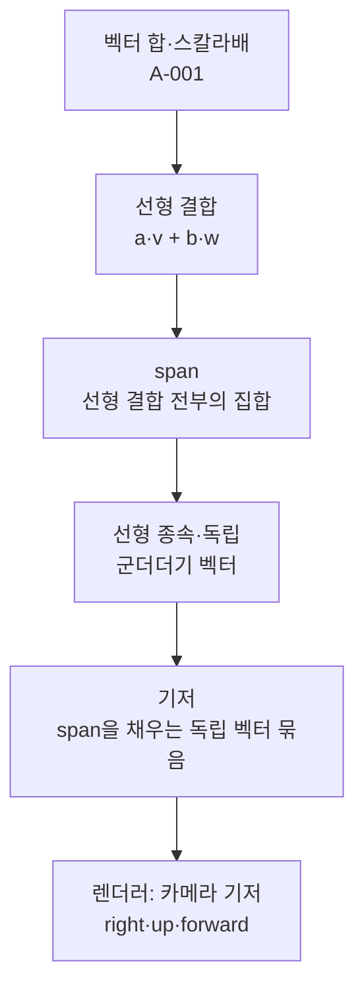

# 선형 결합, 생성(span), 기저

## 내 설명

### 2026-10-07

선형 결합이란 u v w 가 있을 때 w = a * u + b * v 와 같이 나타낼 수 있는 것을 뜻한다.
span이란 확장 가능한 공간으로, 벡터가 선형 결합하여 나타낼 수 있는 모든 공간을 뜻한다.
선형 종속이란 선형 결합처럼 한 선이나 평면 위에 벡터가 포함될 때 그 벡터를 생략할 수 있는 것을 뜻한다.
기저 = ? 잘 모르겠음

> 정정(선형 결합): 선형 결합은 "w를 그렇게 쓸 수 있다"는 성질이 아니라, 스칼라배해서 더한 식 $a\mathbf{u} + b\mathbf{v}$ 자체(그 결과 벡터)다. "w는 u, v의 선형 결합이다"가 그 성질을 말하는 표현이다.
>
> 정정(span): "모든 공간"이 아니라 선형 결합으로 만들 수 있는 **모든 벡터의 집합**이다. 그 집합이 직선·평면·공간 전체 중 하나가 된다.
>
> 정정(선형 종속): "한 선이나 평면 위에 있으면"이 아니라 "**나머지 벡터들의 span 안에** 있으면"이다. 2차원에서 평행하지 않은 두 벡터는 같은 평면 위에 있지만 독립이다.
>
> 정정(기저): 기저 = span이 공간 전체이면서 선형 독립인 벡터 묶음. 공간의 모든 점을 딱 한 가지 계수로 표현하게 해 준다. 3차원의 기저는 항상 정확히 3개다.

## 핵심

- **선형 결합**: $a\mathbf{u} + b\mathbf{v} + c\mathbf{w}$ (성분별로 스칼라배 후 덧셈)
- **span**: $\{a\mathbf{u} + b\mathbf{v} + \dots \mid a, b, \dots \in \mathbb{R}\}$
  - 벡터 하나 → 원점을 지나는 직선
  - 평행한 두 벡터 → 여전히 직선
- **선형 종속**: 한 벡터가 나머지의 선형 결합으로 쓰인다 → 빼도 span이 그대로
- **판별 절차** ($\mathbf{w}$가 $\mathbf{u}, \mathbf{v}$에 종속인가):
  1. $\mathbf{w} = a\mathbf{u} + b\mathbf{v}$ 로 놓는다
  2. 성분마다 식을 하나씩 쓴다 (3D면 식 3개, 미지수 2개)
  3. 두 식으로 $a, b$를 구해 **남은 식까지** 대입해 확인 → 성립하면 종속(span = 평면), 모순이면 독립(span = 3D)
- 쌍마다 평행하지 않다고 해서 독립인 것은 아니다. 반례: $(1,0,0), (0,1,1), (2,3,3)$ — 셋째 $= 2\cdot$첫째 $+ 3\cdot$둘째
- **기저**: span = 전체 공간 + 선형 독립. 3D의 기저는 정확히 3개
- **렌더러**: 카메라 right·up·forward는 기저여야 한다. `up = right + forward` 같은 버그가 나면 span이 평면으로 줄어 장면이 납작해진다.

## 의존성

## 틀린 것

- 스칼라배 전체의 집합(?): $\{c\mathbf{v}\}$는 원점을 지나는 직선이다.
- 3D 선형 종속(? → X → O): 세 벡터라도 하나가 나머지의 결합이면 span은 평면이다.
- 쌍마다 비평행 = 독립(?): 거짓이다. 셋째 벡터가 앞의 두 벡터가 만든 평면 안에 있는지 봐야 한다.
- 계수 풀기(? → X): 식 3개 중 2개만 확인했다. $a+b=0$ 식을 대입하지 않아 모순을 놓쳤다. 남은 식까지 반드시 대입한다.
- 기저(teach-back): 문제는 맞혔지만(확신 1) 정의를 말로 하지 못했다.

## 출처

- 3Blue1Brown, *Essence of Linear Algebra* Ch.2 "Linear combinations, span, and basis vectors" — https://www.youtube.com/watch?v=k7RM-ot2NWY · https://www.3blue1brown.com/lessons/span
- Strang, *Introduction to Linear Algebra* §1.1 "Vectors and Linear Combinations"

## 세션

- [2026-10-02](../../log/sessions/2026-10-02-0951-span-basis.md)
