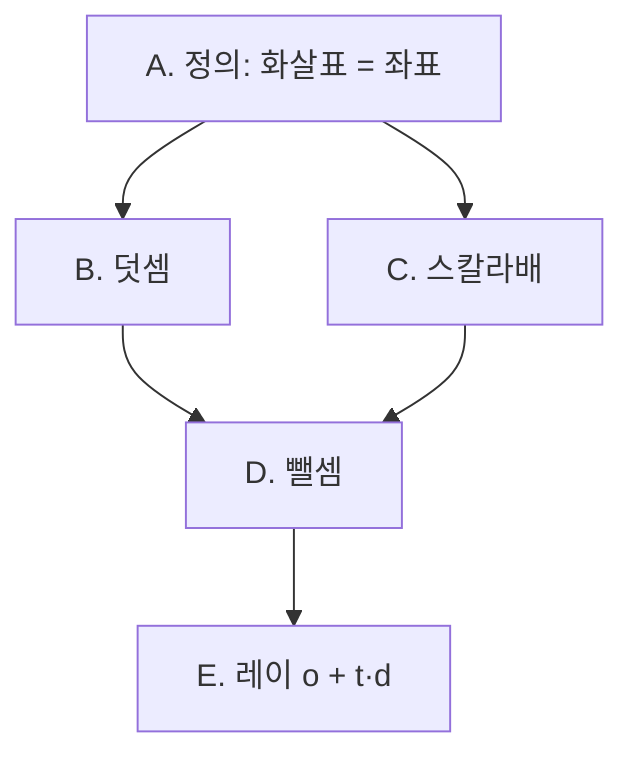

# 벡터

## 내 설명

### 2026-10-01

백터란 좌표계에 좌표값과 방향을 나타낸 일종의 힘이다. 대표적인 연산 방법은 덧셈과, 스칼라 배가 있고 그래픽스에서 자주 쓰인다. 덧셈의 경우 첫 항의 머리에 다음 연산하는 항의 꼬리를 붙이는 것과 같다. 스칼라 해의 경우 순수한 수인 "스칼라 = 숫자"를 벡터에 곱하는 것으로 곱하는 수에 따라 길이가 늘어나거나 줄어든다. 부호에 따라서는 방향이 바뀐다. 각 연산의 경우 벡터 내부의 각 항에 더하거나 곱하는 것과 연산이 동일하다.

> 정정: 벡터는 "힘"이 아니다. 힘은 벡터로 나타낼 수 있는 물리량의 한 예다. 선형대수에서 벡터는 원점에서 시작하는 화살표이자 좌표 목록 $(x, y)$이고, 더 일반적으로는 덧셈과 스칼라배가 정의된 대상이다.

## 핵심

| 연산 | 그림 | 계산 |
|---|---|---|
| 덧셈 $\mathbf{v}+\mathbf{w}$ | $\mathbf{v}$의 머리에 $\mathbf{w}$의 꼬리를 붙이고, 원점 → $\mathbf{w}$의 머리 | 성분끼리 더함 |
| 스칼라배 $c\,\mathbf{v}$ | 같은 직선 위, 길이 $\lvert c\rvert$배, $c<0$이면 방향 반대 | 성분마다 $c$를 곱함 |
| 뺄셈 $\mathbf{w}-\mathbf{v}$ | $\mathbf{v}$의 머리 → $\mathbf{w}$의 머리 | $\mathbf{w} + (-1)\mathbf{v}$ |

레이: $\mathbf{p}(t) = \mathbf{o} + t\,\mathbf{d}$. $\mathbf{o}$는 출발점(위치), $\mathbf{d}$는 방향, $t$는 스칼라다. $t=0$이면 $\mathbf{o}$이고, $t$가 커지면 $\mathbf{d}$ 방향으로 나아간다. 방향 벡터는 "도착점 − 출발점"으로 구한다.

## 의존성

## 틀린 것

- 덧셈 그림(X): "끝점과 끝점을 잇는 화살표"는 덧셈이 아니라 뺄셈 $\mathbf{w}-\mathbf{v}$다. 덧셈은 꼬리를 머리에 붙인다.
- 음수 스칼라배 그림(?): $-2\mathbf{v}$는 같은 직선 위에서 방향이 반대이고 길이가 2배다.

## 출처

- 3Blue1Brown, *Essence of Linear Algebra* Ch.1 "Vectors, what even are they?" — https://www.youtube.com/watch?v=fNk_zzaMoSs · https://www.3blue1brown.com/lessons/vectors
- Strang, *Introduction to Linear Algebra* §1.1 "Vectors and Linear Combinations"

## 세션

- [2026-10-01](../../log/sessions/2026-10-01-1550-vectors.md)
- [2026-10-02 재채점](../../log/sessions/2026-10-02-0943-vectors.md)
